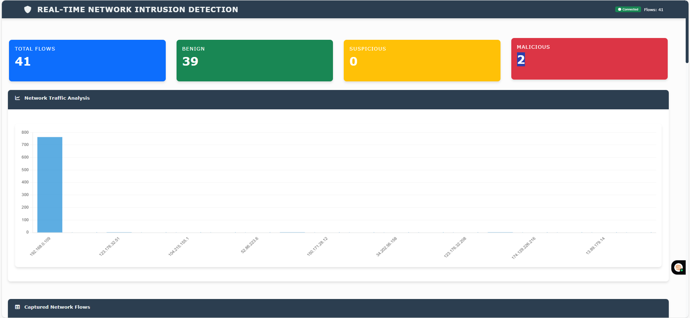

# 🛡️ Intrusion Detection System (IDS)

This project is a real-time, explainable AI-based Intrusion Detection System (IDS) built using a hybrid of deep learning and classical machine learning. It is designed to monitor and classify network traffic, detect anomalies, and interpret decisions in real-time.

---

##  Key Features

- **Anomaly Detection with Autoencoder**  
  Learns the normal behavior of network traffic and detects deviations without needing labeled attack data.

- **Attack Classification using Random Forest**  
  Known attack patterns are classified using a trained Random Forest model into categories like DoS, Brute Force, Port Scanning, etc.

- **Imbalanced Data Handling with SMOTE**  
  Applies SMOTE (Synthetic Minority Oversampling Technique) to balance attack vs. normal traffic classes during training.

- **Explainable AI with LIME**  
  Each classification decision is accompanied by LIME-based local interpretations to explain which features influenced the model’s prediction.

- **Real-time Web Dashboard (Frontend)**  
  A live interface displays:
  - Detected attack type  
  - Risk score  
  - LIME explanations for model decisions  
  - Packet flow and feature visualization

---

## Machine Learning Overview

### 1. **Autoencoder (Unsupervised Learning)**
- Trained on benign traffic only
- Detects anomalous traffic by reconstruction error
- Used for zero-day attack detection

### 2. **Random Forest Classifier (Supervised Learning)**
- Trained on labeled attack data (after SMOTE balancing)
- Classifies anomalies into known categories
- Outputs: Attack Type and Risk Score

### 3. **Interpretability using LIME**
- Provides feature-level explanation for each classified attack
- Highlights most influential features for a given prediction

---

## Dataset Used: CICIDS-2018

- **Source**: Canadian Institute for Cybersecurity  
  [Link to dataset](https://www.unb.ca/cic/datasets/ids-2018.html)

- **Total Features Used**: 39 network traffic features per packet flow

- **Attack Categories**:
  - Brute Force (FTP/SSH)
  - DoS (Hulk, Slowloris, GoldenEye)
  - Web Attacks
  - Infiltration
  - Botnet
  - Port Scan
  - DDoS

- **Label Distribution**:
  - Highly imbalanced (most traffic is benign)
  - Addressed using **SMOTE** to balance training data

- **Preprocessing Includes**:
  - Feature selection
  - Standard scaling
  - Packet reassembly and flow aggregation

---

## 🌐 Web Interface

- Built with Flask (backend)
- HTML + CSS + JS (templating engine)
- Displays:
  - Recent network traffic logs
  - Live detection with color-coded risk levels
  - LIME visualization in detail view

---

## 📷 Sample Visual Outputs
**Figure 1:** *Live detection dashboard screenshot*  
)

**Figure 2:**  


---

## ▶️ Run the Project

Download project folder & environment setup:

```bash
# Create a virtual environment
python3.9 -m venv venv

# Activate the virtual environment
source venv/bin/activate  # For Windows: venv\Scripts\activate

# Install dependencies
pip install -r requirements.txt

python app.py

🌐 Web app address: http://localhost:5000

